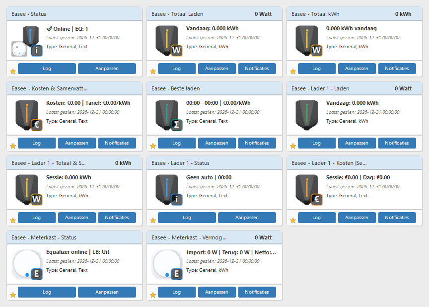
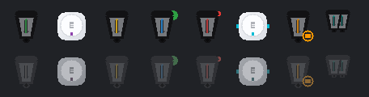
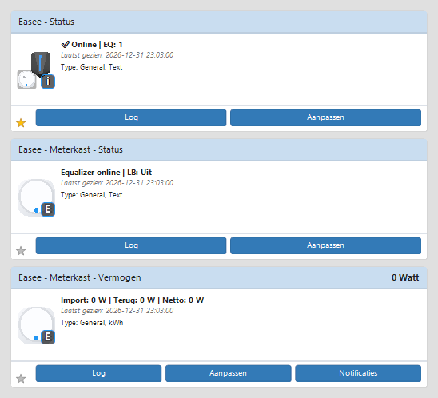

# Easee Domoticz Plugin **v1** (0.6.1)

**Easee-laadpalen, Equalizer (meterkast) en optionele energieprijs (Geen/Handmatig/Tibber/ENTSO-E/EnergyZero) in Domoticz — modulaire plugin, custom tegeliconen, compacte statusweergave.**


> **Status (v1 branch):** **0.6.1** — Prijsbron Geen/Handmatig/Tibber/**ENTSO-E**/**EnergyZero** (alle getest); handmatig **Vast**, **Dag/nacht** of **Dal/piek**; P1/zon/thuisbatterij-hints. **Niet** productie-stable — **gereed voor 1.0.0-stable** na soak test. Zie [STABLE.md](STABLE.md), [VERSIONING.md](VERSIONING.md), [docs/RELEASE_1.0.0.md](docs/RELEASE_1.0.0.md).
>
> **Legacy productie:** branch `main` / tag [**v10.11.6-stable**](https://github.com/rleunk/easee-domoticz/releases/tag/v10.11.6-stable) — aanbevolen voor live Domoticz. v10 blijft bevroren; geen hernummering naar 0.10.x.

## TL;DR — installeren in 2 minuten

```bash
cd /home/root/domoticz/plugins
git clone git@github.com:rleunk/easee-domoticz.git Easee-Domoticz-plugin
cd Easee-Domoticz-plugin
git fetch origin
git checkout v1   # v1 ontwikkeling; voor productie: git checkout v10.11.6-stable
sudo systemctl restart domoticz
```

In Domoticz: **Setup → Hardware → Python plugins** → **Easee Domoticz plugin v1 (0.6.1)** → Easee-gebruikersnaam + wachtwoord → **Create**.

**Kosten-tegels:** kies **Prijsbron** (Mode9): **Tibber** (default, Mode7 token) · **ENTSO-E** (Mode24 token + toeslagen) · **EnergyZero** (geen token) · **Handmatig** (Vast Mode10, Dag/nacht of Dal/piek Mode11–19) · **Geen** (alleen kWh/laaduren, geen €). Hardware-groep **Energieprijs (optioneel)**. Optioneel **Energie hints** (P1 / Zonnepanelen / Thuisbatterij, Mode20–23 — elke merknaam in Domoticz werkt, bijv. Sessy, Powerwall). Verder optioneel: laadpaalnamen (Mode2/3/4), Equalizer-naam (Address).

> Git-authenticatie: [docs/GIT_SETUP.md](docs/GIT_SETUP.md) · Problemen: [docs/TROUBLESHOOTING.md](docs/TROUBLESHOOTING.md)

## Wat doet deze plugin?

- Auto-detectie van laadpalen en Equalizer
- Live vermogen, status en load balancing in Domoticz
- Kosten via **Prijsbron Tibber** (sessie, dag, goedkoopste laadwindow), **ENTSO-E** (day-ahead spot + toeslagen) of **Handmatig** (vast Mode10, dag/nacht of dal/piek Mode11–19); **Geen** = geen €
- **P1 / zon / thuisbatterij hints** op Status en Dag overzicht (geen laadsturing)
- 13 custom tegeliconen (P-max laadpaal + Equalizer-puck) — auto-load + handmatige upload als fallback
- Modulaire codebase (sinds v10.6) — updates via `git pull`

## Voor wie is dit?

- Domoticz-gebruikers met Easee-laadpaal(en)
- Met of zonder Equalizer (meterkast)
- Optioneel met Tibber-energiecontract (voor kosten/tarief-tegels)
- Geen programmeerkennis nodig — scannable tegels en Nederlandse status

## Features

| Onderdeel | Wat je krijgt |
|-----------|---------------|
| **Laadpalen** | Auto-discovery; per lader: **Laden** (grafiek + sessie in Description), **Status** (incl. kosten bij Tibber) |
| **Equalizer** | 2 tegels per Equalizer: **Status** (LB, limieten, stroom, spanning) + **Vermogen** (import/terug/netto W, vandaag kWh) |
| **Tibber** | Actueel tarief, **Dag overzicht**, **Beste laden** — **Mode7 + Prijsbron Tibber** |
| **ENTSO-E** | Day-ahead spot NL + toeslagen — **Mode24 token + Mode25–27** |
| **EnergyZero** | Publieke NL uurprijzen — **geen token** (Mode29 info-link) |
| **Prijsbron** | **Geen** (kWh only) · **Handmatig** (Vast/Dag-nacht/Dal-piek) · **Tibber** (default) · **ENTSO-E** · **EnergyZero** |
| **Energie hints** | P1 (Mode21), Zonnepanelen (Mode22), Thuisbatterij (Mode23) — context op Status/Dag overzicht; elke batterij-merknaam in Domoticz |
| **Core** | Globale Status, Totaal Laden, Totaal kWh, LoadBal-schakelaar |
| **Iconen** | 13 sets in `Easee_icons_v2.zip`; zie [Custom iconen](#-custom-iconen) |
| **Upgrade** | `git pull` + hardware herstarten; bij icon-wijzigingen zip opnieuw uploaden |

Verder: eigen namen per laadpaal (Mode2/3/4), state in `easee_state.json`, gestructureerde logging `[Easee v0.6.1][LEVEL]…`.

## v1 releases

| Versie | Status |
|--------|--------|
| **0.6.1** | Status-tegel toont actieve prijsbron (alle Mode9-waarden) |
| **0.6.0** | EnergyZero prijsbron (geen token) |
| **0.5.0** | ENTSO-E day-ahead spot + toeslagen |
| **0.4.1** | Thuisbatterij-labels (generiek i.p.v. Sessy) |
| **0.4.0** | Handmatig Dal/piek; P1/zon/thuisbatterij hints |
| **0.3.0** | Energieprijs UI-reorder; Handmatig Vast + Dag/nacht |
| **0.2.1** | BesteLadenHours fix; parameter-volgorde |
| **0.2.0** | Prijsbron Geen/Handmatig/Tibber; `pricing/` end-to-end |
| **0.1.0** | Scaffold; Tibber-only runtime gelijk aan v10.11.6-stable |

## Logniveaus (kort)

| Niveau | Wanneer zichtbaar | Voorbeelden |
|--------|-------------------|-------------|
| **INFO** | Altijd (Mode6 = Normal) | Plugin gestart, Tibber actief/uit, iconen geladen (`image_ids: 13/13`), migratie bij upgrade |
| **DEBUG** | Alleen bij Mode6 = *Debug* | Poll voltooid, kosten-tegel bijgewerkt, siteStructure-details, per-tegel iconen, **verwachte optionele API 403/405** |
| **WARNING** | Altijd | Kosten-tegel niet gevonden, **HTTP 429**, iconen ontbreken |
| **ERROR** | Altijd | Login mislukt, zip laden mislukt |

Zet **Debug logging** (Mode6) alleen aan als je problemen onderzoekt — dan wordt het log veel uitgebreider.

## Screenshots

> **Let op:** de afbeeldingen hieronder zijn **gesanitiseerde demo-mockups** in echte Domoticz-tegelstijl (lichtgrijze achtergrond, witte tegels met lichtblauwe header, italic *Laatst gezien*, *Type:*-regel, footer met ster links en Log/Aanpassen-knoppen) — geen live Domoticz-data. Alle getallen zijn **0** / **€0.00**. De README-demo toont **11 actieve tegels + LoadBal** (2 laadpalen, EQ, Tibber) — zie [CONFIGURATION.md](docs/CONFIGURATION.md). Opnieuw genereren: `scripts/generate_dashboard_mockup.ps1`.

### Dashboard (11 tegels + LoadBal)



*Demo-layout (3×4): globale tegels incl. **Dag overzicht** + LoadBal, 2× laadpaal (**Laden** + **Status**), 2 Equalizer-tegels (*Meterkast*). Geen aparte *Dagrapport*, *Kosten & Samenvatting*, *Totaal & Sessie* of *Kosten (Sessie/Dag)* — die zijn samengevoegd in v10.11.*

### Iconen (actuele referentie)



*Actuele iconensets v10.9.18+, inclusief `EaseeStatusGlobal` (combo: EQ linksonder, laadpaal rechtsboven) en `EaseeStatus` (laadpaal-only). Gegenereerde preview, geen Domoticz-capture.*

### Equalizer & combo-icoon (demo)



*Close-up in Domoticz-tegelstijl: combo-icoon op globale Status, Meterkast Status (LB/fase/spanning) en Vermogen (import/terug/netto). Gesanitiseerde waarden.*

## Ondersteunde scenario's

| Scenario | Wat werkt | Configuratie |
|----------|-----------|--------------|
| **1 laadpaal** | Alle laadpaal-tegels + totaal | Alleen **Mode2** (optioneel) |
| **2 laadpalen** | Per lader eigen tegels | **Mode2** + **Mode3** (optioneel) |
| **3+ laadpalen** | Auto-discovery + tegels per lader | **Mode4** (komma-gescheiden vanaf lader 3) |
| **Geen Equalizer** | Plugin werkt volledig | Geen meterkast-tegels; Status toont `Geen EQ` |
| **Geen prijsbron / Geen** | Laadpalen + Equalizer OK | Prijsbron **Geen**; *Dag overzicht* kWh+laaduren; log: *kosten uitgeschakeld* |
| **Handmatig tarief** | Kosten zonder Tibber/ENTSO-E | Prijsbron **Handmatig** + **Vast** (Mode10), **Dag/nacht** of **Dal/piek** (Mode11–19) |
| **ENTSO-E spot** | Day-ahead zonder Tibber | Prijsbron **ENTSO-E** + Mode24 token + toeslagen Mode25–27 |
| **EnergyZero** | Uurprijzen zonder token | Prijsbron **EnergyZero** — geen extra velden |
| **Geen Tibber-token** | Alleen bij Prijsbron Tibber | Geen kosten-tegels; log: *Tibber uit* |

Laat naamvelden leeg voor de Easee-appnaam. De **hardwarenaam** in Domoticz (bijv. `Easee`) is het prefix op alle tegels.

## Devices

### Core
- **Easee - Status** — online, Equalizer-aantal, load balancing, actieve prijsbron (Mode9)
- **Totaal Laden**, **Totaal kWh**, **LoadBal**
- **Beste laden**, **Dag overzicht** (bij actieve prijsbron: Tibber, ENTSO-E, EnergyZero of Handmatig)

### Per Equalizer
- **[Naam] - Status** — verbinding, LB (fase-detail), limieten, stroom L1/L2/L3, spanning
- **[Naam] - Vermogen** — import/terug/netto W, vandaag import en netto kWh (Text-tegel)

### Per laadpaal
- **[Naam] - Laden** — vermogen + grafiek; sessie/vandaag/totaal kWh in Description (v10.11+)
- **[Naam] - Status** — laadtoestand, timer, laadhint + sessie/dag € bij actieve prijsbron (v10.11+)

**Verouderd sinds v10.11** (verborgen na upgrade, `Used=0`): *Kosten & Samenvatting*, *Dagrapport*, *Totaal & Sessie*, *Kosten (Sessie/Dag)*.

Details: [docs/CONFIGURATION.md](docs/CONFIGURATION.md).

## Custom iconen

De plugin levert **13 iconensets** via **`Easee_icons_v2.zip`** (master zip + map `icons/` met 13 mini-zips).

**Automatisch:** bij pluginstart geladen en toegepast op bestaande tegels na herstart.

**Handmatig** (als log `image_ids: 0/13` of generieke iconen):
1. Verwijder oude Easee custom icons via **Instellingen → Aangepaste pictogrammen**
2. Upload `Easee_icons_v2.zip`
3. Herstart hardware-item

Verwacht in log: `Custom icons geladen: 13 sets` of `Custom icons uit Domoticz (handmatig geüpload)` en `image_ids: 13/13 sets`.

### Welke tegel krijgt welk icoon?

| Iconenset | Tegel(s) |
|-----------|----------|
| **EaseeStatusGlobal** | Alleen globale **Easee - Status** (laadpaal + EQ-puck + **i**) |
| **EaseeStatus** | Laadpaal **Status** per locatie (bijv. Lader 1, Garage, Voordeur) — laadpaal + **i**, geen EQ |
| **EaseeEqualizer** | Equalizer **Status** en **Vermogen** (Meterkast) |
| **EaseeCharger** | Laadpaal **Laden** |
| **EaseePower** | **Totaal Laden**, **Totaal kWh** |
| **EaseeCost** | Legacy kosten-tegels (v10.10.x) |
| **EaseeOverview** | **Beste laden**, **Dag overzicht** |
| **EaseeLoadBal** | **LoadBal**-schakelaar |
| Overige sets | Legacy/gereserveerd (Import, Export, Net, Voltage, Alert) |

**Bekende beperking:** sommige **Energy**-tegels (bliksem/globe) tonen ondanks custom Image het Domoticz-standaardicoon — bekend Domoticz-gedrag.

Volledige LED/badge-tabel: [INSTALL.md — Custom iconen](INSTALL.md#custom-iconen-handmatig-uploaden) · preview: [docs/icon-preview-v2.png](docs/icon-preview-v2.png).

## Configuratie (kort)

| Parameter | Standaard | Omschrijving |
|-----------|-----------|--------------|
| Username / Password | — | Easee-inlog (verplicht) |
| Poll interval (Mode1) | 30 sec | API-interval; zet op **60 sec** bij 429-waarschuwingen (zie [CONFIGURATION.md](docs/CONFIGURATION.md)) |
| Debug (Mode6) | Normal | Zet op *Debug* bij problemen — toont extra DEBUG-regels |
| Mode2 / Mode3 / Mode4 | — | Laadpaalnamen 1 / 2 / 3+ |
| Address / IP | — | Equalizer-naam / handmatig ID |
| Prijsbron (Mode9) | Tibber | **Geen** / **Handmatig** / **Tibber** / **ENTSO-E** / **EnergyZero** |
| Handmatig type (Mode11) | Vast | **Vast** / **Dag/nacht** / **Dal/piek** |
| Vast tarief €/kWh (Mode10) | 0.25 | Alleen **Handmatig — Vast** |
| Dal/normal/piek €/kWh (Mode12/13/16) | 0.22 / 0.28 / 0.35 | **Dag/nacht** of **Dal/piek** |
| Dal start/eind uur (Mode14/15) | 23 / 7 | **Dag/nacht** / **Dal/piek** |
| Piek start/eind uur (Mode17/18) | 17 / 21 | Alleen **Dal/piek** |
| Weekend alles dal (Mode19) | Ja | Alleen **Dal/piek** |
| P1/zon/thuisbatterij hints (Mode20–23) | Aan / Power / Zonnepanelen / Sessy | Mode23 default `Sessy`; zet op jouw batterij-naam (Powerwall, etc.) |
| Tibber token (Mode7) | — | **Vereist** bij Prijsbron Tibber |
| ENTSO-E token (Mode24) | — | **Vereist** bij Prijsbron ENTSO-E |
| EnergyZero info (Mode29) | dynamische-energieprijzen.nl | Alleen bij Prijsbron **EnergyZero** — geen token |
| Opslag / belasting / BTW (Mode25–27) | 0 / 0 / 21 | Alleen **ENTSO-E** — vul in naar jouw contract |

Zie [docs/CONFIGURATION.md](docs/CONFIGURATION.md).

## Updates & upgrade

```bash
cd /home/root/domoticz/plugins/Easee-Domoticz-plugin
git fetch --tags origin
git checkout v1              # v1 ontwikkeling
# of voor productie: git checkout v10.11.6-stable
sudo systemctl restart domoticz
```

**Na elke upgrade:** herstart het Easee hardware-item in Domoticz. Zie [STABLE.md](STABLE.md) voor stable-tags en rollback.

**Bij icon-wijzigingen (v10.9.5+):** upload **`Easee_icons_v2.zip` opnieuw** via Aangepaste pictogrammen. Controleer log: `image_ids: 13/13 sets`.

Stap-voor-stap: [INSTALL.md](INSTALL.md).

## Changelog & release

- Volledige geschiedenis: [CHANGELOG.md](CHANGELOG.md) — v1 start bij 0.1.0; legacy v10 hieronder in changelog
- **v1 (branch `v1`):** [v0.6.1](https://github.com/rleunk/easee-domoticz/releases/tag/v0.6.1) · [v0.6.0](https://github.com/rleunk/easee-domoticz/releases/tag/v0.6.0) · [v0.5.0](https://github.com/rleunk/easee-domoticz/releases/tag/v0.5.0) · [v0.4.1](https://github.com/rleunk/easee-domoticz/releases/tag/v0.4.1) · [v0.4.0](https://github.com/rleunk/easee-domoticz/releases/tag/v0.4.0) · [v0.3.0](https://github.com/rleunk/easee-domoticz/releases/tag/v0.3.0) · [v0.2.1](https://github.com/rleunk/easee-domoticz/releases/tag/v0.2.1) · [v0.2.0](https://github.com/rleunk/easee-domoticz/releases/tag/v0.2.0) · [v0.1.0](https://github.com/rleunk/easee-domoticz/releases/tag/v0.1.0)
- **Legacy stable:** **[v10.11.6-stable](https://github.com/rleunk/easee-domoticz/releases/tag/v10.11.6-stable)** — productie op `main`
- Vorige stable: [v10.11.4-stable](https://github.com/rleunk/easee-domoticz/releases/tag/v10.11.4) (rollback)
- Oudere rollback: [v10.11.2-stable](https://github.com/rleunk/easee-domoticz/releases/tag/v10.11.2)
- Oudere rollback: [v10.9.32-stable](https://github.com/rleunk/easee-domoticz/releases/tag/v10.9.32)

### v10.9.19 – v10.9.28 in het kort

| Versie | Thema |
|--------|-------|
| **10.9.28** | Versies gesynchroniseerd; kosten-tegels niet meer vast op €0,00; stale sessionEnergy-fix; cost_track migratie |
| **10.9.27** | Negatieve Vandaag kWh (v10.9.26-regressie) opgelost; lifetime Counter + dagtracking |
| **10.9.26** | Vandaag kWh ~3 kWh-fix; kosten timestamp/delta; state migratie |
| **10.9.24–10.9.25** | Middernacht-baseline dag-kWh; display_wh reset na middernacht |
| **10.9.21–10.9.23** | Kosten DeviceID lookup (legacy); 429/herstart fallback; sessie-kWh decimalen |
| **10.9.19–10.9.20** | Legacy *Kosten*-tegel lookup; sessielabel tijdens laden |

### Eerdere v10.9.x

| Versie | Thema |
|--------|-------|
| **10.9.18** | `EaseeStatusGlobal` combo-icoon verfijnd |
| **10.9.17** | Equalizer Vermogen sticky power; per-endpoint rate limit |
| **10.9.11–10.9.16** | Equalizer poll/429/observations fixes |
| **10.9.0–10.9.10** | Equalizer 2 tegels; icon mapping; combo-icoon |

## Troubleshooting (snel)

| Probleem | Zie |
|----------|-----|
| Plugin niet in lijst | [INSTALL.md](INSTALL.md) — pad + `python3-requests` |
| Geen iconen | [docs/TROUBLESHOOTING.md](docs/TROUBLESHOOTING.md) — custom iconen |
| Login mislukt | Credentials + rate limit (5–10 min wachten) |
| Geen Equalizer | Debug aan; handmatig ID in IP-veld |
| Kosten 0 € / geen kosten-tegels | Controleer **Prijsbron (Mode9)** + bijbehorend token (Tibber Mode7 / ENTSO-E Mode24); tile verwijderen + hardware herstarten |
| 429 rate limit in log | Poll interval (Mode1) op **60 sec** — [TROUBLESHOOTING.md](docs/TROUBLESHOOTING.md#http-429-rate-limit-easee-api)
| Verkeerd icoon op tegel | Upgrade naar v10.9.18+; zip opnieuw uploaden |

## Module structuur

Sinds v10.6.0 modulair; v1 (0.2.0+) voegt **`pricing/`** (prijsbronnen) en **`domoticz_energy_hints.py`** toe — **14** root-modules + `pricing/` (9 bestanden, **23** totaal). Overzicht: [docs/REFACTOR_MAPPING.md](docs/REFACTOR_MAPPING.md). Pad naar **1.0.0-stable**: [docs/RELEASE_1.0.0.md](docs/RELEASE_1.0.0.md).

## Problemen melden

[GitHub Issues](https://github.com/rleunk/easee-domoticz/issues) → **Bug melden** (Nederlands formulier). Vermeld pluginversie **v0.6.1** (v1) of **v10.11.6-stable** (legacy), Domoticz-versie en logregels `[Easee v…]` (geen wachtwoorden).

## Support & credits

- **Repo:** [github.com/rleunk/easee-domoticz](https://github.com/rleunk/easee-domoticz)
- **Installatie:** [INSTALL.md](INSTALL.md)
- **Easee API:** [developer.easee.com](https://developer.easee.com/) · **Tibber:** [developer.tibber.com](https://developer.tibber.com/)

MIT License — [LICENSE](LICENSE)

---

**Versie 0.6.1** (v1 branch) — Richard Leunk · Legacy productie: **v10.11.6-stable** op `main`
