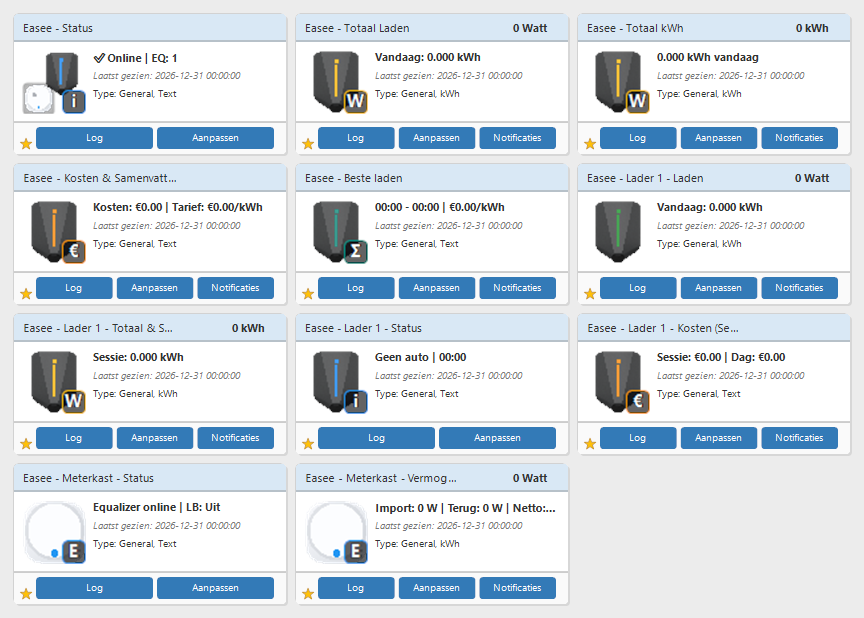
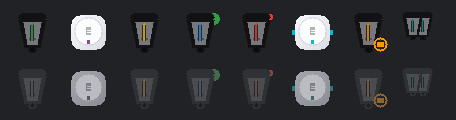

# Easee Domoticz Plugin **v1** (1.1.7)

**Language:** **English** (this page) · [Nederlands](README.nl.md)

**Easee EV chargers, Equalizer (meter cupboard) and optional energy pricing (None/Manual/Tibber/ENTSO-E/EnergyZero) in Domoticz — modular plugin, custom tile icons, compact status display.**


> **Status (production):** **`main`** = **1.1.7** — charger observations API (Easee Sep 2026), NL/EN UI, LB phase detail; **11 tiles + LoadBal**. See [STABLE.md](STABLE.md), [VERSIONING.md](VERSIONING.md), [docs/RELEASE_1.1.7.md](docs/RELEASE_1.1.7.md).
>
> **Legacy v10:** branch **`legacy/v10`** / tag [**v10.11.6**](https://github.com/rleunk/easee-domoticz/releases/tag/v10.11.6) — for existing v10 installs or rollback. v10 is frozen.
>
> **Development:** branch **`v1`** for future 1.2.x releases.

## TL;DR — install in 2 minutes

```bash
cd /home/USER/domoticz/plugins
git clone https://github.com/rleunk/easee-domoticz.git Easee-Domoticz-plugin
cd Easee-Domoticz-plugin
git checkout main   # production 1.1.7; legacy v10: git checkout legacy/v10
sudo systemctl restart domoticz
```

In Domoticz: **Setup → Hardware → Python plugins** → **Easee Domoticz plugin v1 (1.1.7)** → Easee username + password → **Create**.

**Cost tiles:** set **Price source** (Mode9): **Tibber** (default, Mode7 token) · **ENTSO-E** (Mode24 token + markup) · **EnergyZero** (no token) · **Manual** (Fixed Mode10, Day/night or Off-peak/peak Mode11–19) · **None** (kWh and hours only, no €). Optional **Energy hints** (P1 / Solar / Home battery, Mode20–23). Optional charger names (Mode2/3/4), Equalizer name (Address).

> Git auth: [docs/GIT_SETUP.md](docs/GIT_SETUP.md) · Issues: [docs/TROUBLESHOOTING.md](docs/TROUBLESHOOTING.md)

## What does this plugin do?

- Auto-discovery of chargers and Equalizer
- Live power, status and load balancing in Domoticz
- Costs via **Tibber**, **ENTSO-E**, **Manual** tariffs, or **None**
- **P1 / solar / home battery hints** on Status and Daily overview (display only)
- 13 custom tile icon sets — auto-load + manual upload fallback
- Modular codebase — updates via `git pull`

## Who is it for?

- Domoticz users with Easee charger(s)
- With or without Equalizer
- Optional Tibber or other dynamic pricing
- No coding required — scannable tiles; **Dutch** (default) or **English** (Mode30)

## Features

| Area | What you get |
|------|----------------|
| **Chargers** | Auto-discovery; per charger: **Charging** (graph + session in Description), **Status** (incl. costs) |
| **Equalizer** | **Status** (LB, limits, phases) + **Power** (import/export/net W, today kWh) |
| **Tibber** | Current rate, **Daily overview**, **Best charging** — Mode7 + Tibber price source |
| **ENTSO-E** | NL day-ahead spot + markup — Mode24 token + Mode25–27 |
| **EnergyZero** | Public NL hourly prices — no token |
| **Price source** | None · Manual · Tibber (default) · ENTSO-E · EnergyZero |
| **Energy hints** | P1 (Mode21), Solar (Mode22), Home battery (Mode23) |
| **Core** | Global Status, Total charging, Total kWh, LoadBal switch |
| **Language** | **Dutch** (default) or **English** (Mode30) — tile text and status |
| **Upgrade** | `git pull` + restart hardware item |

Logging: `[Easee v1.1.7][LEVEL]…` in Domoticz log.

## v1 releases

| Version | Status |
|---------|--------|
| **1.1.7** | **Stable production** (`main`) — Easee charger observations API hotfix (Sep 2026) |
| **1.1.6** | Rollback — English UI (Mode30); charger state broken after Easee API cutoff |
| **1.1.5** | Rollback — LB phase detail, soak confirmed Aug 2026 |
| **1.0.0** | Previous stable — five price sources, hints, 11 tiles |

See [CHANGELOG.md](CHANGELOG.md) for full history · Release notes: [docs/RELEASE_1.1.7.md](docs/RELEASE_1.1.7.md) · [docs/nl/RELEASE_1.1.7.md](docs/nl/RELEASE_1.1.7.md)

## Screenshots



*Sanitised demo — 11 tiles + LoadBal. Regenerate: `scripts/generate_dashboard_mockup.ps1`.*



## Supported scenarios

| Scenario | Works | Config |
|----------|-------|--------|
| **1–2 chargers** | Per-charger tiles | Mode2 / Mode3 |
| **3+ chargers** | Auto-discovery | Mode4 (comma-separated from charger 3) |
| **No Equalizer** | Full plugin | No meter cupboard tiles |
| **No price source** | kWh + hours | Price source **None** |
| **Manual tariff** | Costs without API | **Manual** + Mode10–19 |
| **ENTSO-E / EnergyZero** | Dynamic pricing | Mode9 + tokens as needed |

## Devices (v1.1.7)

### Core
- **Easee - Status** — online, EQ count, LB, active price source
- **Total charging**, **Total kWh**, **LoadBal**
- **Best charging**, **Daily overview** (when pricing enabled)

### Per Equalizer
- **[Name] - Status** — connection, LB phase detail (Avail≈/Charge/Measured), limits, voltage
- **[Name] - Power** — import/export/net W, today kWh

### Per charger
- **[Name] - Charging** — power graph; session/today/total in Description
- **[Name] - Status** — state, timer, hints + session/day €

Details: [docs/CONFIGURATION.md](docs/CONFIGURATION.md).

## Custom icons

Upload **`Easee_icons_v2.zip`** via Domoticz **Settings → Custom icons** if auto-load fails. Expect log: `image_ids: 13/13 sets`.

| Icon set | Tile(s) |
|----------|---------|
| **EaseeStatusGlobal** | Global **Easee - Status** |
| **EaseeStatus** | Charger **Status** |
| **EaseeEqualizer** | Equalizer **Status** and **Power** |
| **EaseeCharger** | Charger **Charging** |
| **EaseeOverview** | **Best charging**, **Daily overview** |

## Configuration (short)

| Parameter | Default | Description |
|-----------|---------|-------------|
| Language (Mode30) | Nederlands | **English** for tile text |
| Poll interval (Mode1) | 30 s | Use **60 s** on HTTP 429 |
| Price source (Mode9) | Tibber | None / Manual / Tibber / ENTSO-E / EnergyZero |
| Tibber token (Mode7) | — | Required for Tibber |
| ENTSO-E token (Mode24) | — | Required for ENTSO-E |

Full guide: [docs/CONFIGURATION.md](docs/CONFIGURATION.md).

## Updates

```bash
cd /home/USER/domoticz/plugins/Easee-Domoticz-plugin
git fetch --tags origin && git checkout main && git pull origin main
sudo systemctl restart domoticz
```

Restart the Easee hardware item in Domoticz. See [INSTALL.md](INSTALL.md) and [STABLE.md](STABLE.md).

## Releases

- [**v1.1.7**](https://github.com/rleunk/easee-domoticz/releases/tag/v1.1.7) — current production
- [**v1.1.6**](https://github.com/rleunk/easee-domoticz/releases/tag/v1.1.6) — rollback (charger API broken after Sep 2026)
- [**v1.1.5**](https://github.com/rleunk/easee-domoticz/releases/tag/v1.1.5) — rollback

## Report issues

[GitHub Issues](https://github.com/rleunk/easee-domoticz/issues) — mention plugin version **v1.1.7**, Domoticz version, and `[Easee v…]` log lines (no passwords).

## Links

- **Install:** [INSTALL.md](INSTALL.md)
- **All docs:** [docs/README.md](docs/README.md) · Dutch: [README.nl.md](README.nl.md)
- **Easee API:** [developer.easee.com](https://developer.easee.com/) · **Tibber:** [developer.tibber.com](https://developer.tibber.com/)

MIT License — [LICENSE](LICENSE)

---

**Version 1.1.7** (main) — Richard Leunk
