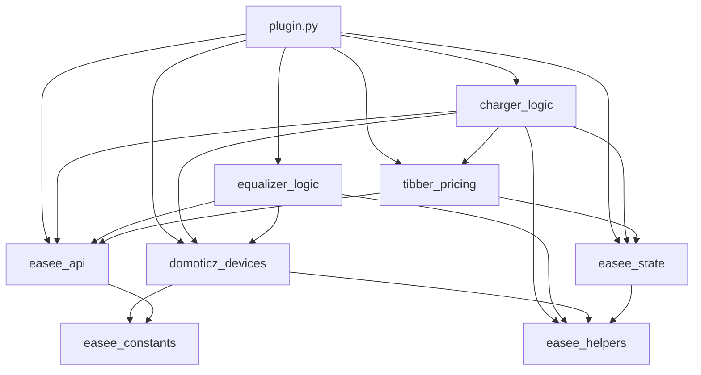

# Refactor-mapping: `plugin.py` → modules

**Status:** module-split uitgevoerd (v10.6.0)  
**Bron:** oorspronkelijk monolithisch `plugin.py` — **2653 regels** (v10.5.18)  
**Resultaat:** 11 bestanden incl. `easee_logging.py`, **~3000 regels** totaal (incl. imports/delegates)

---

## Samenvatting

| Metric | Waarde |
|--------|--------|
| **Totaal regels** | 2653 |
| **Classes** | 1 (`BasePlugin`) |
| **Methods op `BasePlugin`** | 183 (incl. `__init__`) |
| **Geneste functies** | 2 (`score`, `remember_root`) |
| **Module-level entrypoints** | 3 (`onStart`, `onStop`, `onHeartbeat`) |
| **Totaal callable units** | **190** |
| **Module-level constanten** | 8 blokken (regels 48–83) |

### Geschatte regels per voorgestelde module

| Module | ~Regels | Opmerking |
|--------|---------|-----------|
| `easee_constants.py` | 40 | Optioneel; puur data |
| `easee_api.py` | 45 | Dunne HTTP-laag |
| `easee_state.py` | 85 | State file + per-lader state |
| `domoticz_devices.py` | 400 | Devices, index, icons |
| `charger_logic.py` | 280 | Poll + sessie + discovery laders |
| `equalizer_logic.py` | 1250 | Fuse-detectie is ~40% van bestand |
| `plugin.py` (orchestratie) | 250 | Lifecycle + heartbeat-flow |
| **Niet in voorstel (zie §6)** | ~300 | Tibber, shared helpers, emoji |

---

## Gedeelde state & cross-dependencies

### Module-level constanten (regels 48–83)

| Naam | Regel | Voorgesteld |
|------|-------|-------------|
| `BASE_URL`, `LOGIN_URL`, `REFRESH_URL` | 48–50 | `easee_constants.py` |
| `TIBBER_GQL` | 51 | `tibber_pricing.py` *(nieuw)* |
| `STATE_FILE` | 7 | `easee_constants.py` (`easee_state.json`; legacy `easee_v9_0_state.json`) |
| `PLUGIN_KEY`, `ULTRA_DEBUG` | 53–54 | `easee_constants.py` |
| `OP_MODE_LABELS` | 56–66 | `easee_constants.py` |
| `DEVICE_TYPES` | 68–74 | `easee_constants.py` |
| `CORE_DEVICE_IDS` | 76–83 | `easee_constants.py` |

### `BasePlugin.__init__` instance-attributen (regels 86–109)

| Attribuut | Gebruikt door |
|-----------|---------------|
| `session`, `access_token`, `refresh_token` | `easee_api.py`, lifecycle |
| `started`, `sync_done`, `last_poll` | `plugin.py` |
| `units_by_name`, `units_by_devid` | `domoticz_devices.py` |
| `image_ids` | `domoticz_devices.py` (icons) |
| `state` | `easee_state.py`, Tibber, poll |
| `chargers`, `equalizers` | discovery, poll, sync |
| `latest_chargers`, `latest_equalizers` | poll → `update_combined` |
| `charger_names`, `equalizer_names` | sync, display |
| `equalizer_source`, `equalizer_probes` | equalizer discovery |
| `site_fuse_cache` | `equalizer_logic.py` |
| `fuse_structure_logged`, `fuse_first_poll_logged`, `site_structure_numerics_logged` | fuse logging |
| `plugin_dir` | state, icons |

### Externe afhankelijkheden (alle modules)

- `Domoticz`, `Devices`, `Parameters`, `Images` — Domoticz runtime
- `requests` — HTTP (`easee_api`, Tibber)
- `json`, `os`, `time`, `hashlib`, `math`, `datetime` — verspreid

### Architectuurkeuze (refactor)

Aanbevolen patroon: **`BasePlugin` blijft orchestrator** en delegeert naar module-functies of mixin/subklassen die `self` delen. Pure functies zijn lastig omdat vrijwel alles `self.state`, `self.session` en Domoticz-API's nodig heeft.

---

## 1. `easee_constants.py` (optioneel)

| Item | Regel | Rationale |
|------|-------|-----------|
| `BASE_URL`, `LOGIN_URL`, `REFRESH_URL` | 48–50 | Easee API endpoints |
| `TIBBER_GQL` | 51 | *Alternatief:* `tibber_pricing.py` |
| `STATE_FILE` | 52 | State-bestandsnaam (`easee_state.json`; legacy `easee_v9_0_state.json`) |
| `LEGACY_STATE_FILE` | 52 | Oude state-bestandsnaam (migratie) |
| `PLUGIN_VERSION` | 53 | Pluginversie in logs |
| `PLUGIN_KEY`, `ULTRA_DEBUG` | 53–54 | Plugin-identiteit / debug-flag |
| `OP_MODE_LABELS` | 56–66 | Charger status labels |
| `DEVICE_TYPES` | 68–74 | Domoticz device specs |
| `CORE_DEVICE_IDS` | 76–83 | Stable DeviceID's voor core devices |

---

## 1b. `easee_logging.py` (v10.6.0)

| Functie | Rationale |
|---------|-----------|
| `debug` / `info` / `warning` / `error` | Centrale formatter `[Easee vX][LEVEL][module][context] msg` |
| `is_debug_enabled` | `ULTRA_DEBUG` of Domoticz Debug-modus (Mode6) |

**Afhankelijkheden:** `Domoticz`, `domoticz_runtime.Parameters`, `PLUGIN_VERSION`, `ULTRA_DEBUG`.  
**Gebruik:** `plugin.log/debug/error/warning` delegeren hiernaartoe; modules kunnen `easee_logging` direct importeren.

---

## 2. `easee_api.py`

| Method | Regel | Rationale |
|--------|-------|-----------|
| `login` | 653–664 | Easee authenticatie |
| `refresh` | 665–677 | Token refresh |
| `api_get` | 678–684 | GET + 401-retry |
| `api_get_optional` | 685–690 | GET zonder crash |

**Afhankelijkheden:** `self.session`, `self.access_token`, `self.refresh_token`, `LOGIN_URL`, `REFRESH_URL`, `BASE_URL`, `Parameters`, `log`/`error`.

**Niet hier:** `kw_to_watts`, `format_amp`, etc. (regels 692–764) — gedeelde formatting; zie §6.

---

## 3. `easee_state.py`

| Method | Regel | Rationale |
|--------|-------|-----------|
| `state_path` | 315–316 | Pad naar JSON state file |
| `load_state` | 317–326 | Laden bij start |
| `save_state` | 327–332 | Opslaan na poll/sync |
| `charger_state` | 1957–1983 | Per-lader sessie/kosten state in `self.state['chargers']` |
| `today_key` | 256–257 | Dag-reset voor day_cost *(helper)* |
| `now_ts` | 254–255 | Timestamps voor sessie *(helper)* |

**State-structuur:** `{'chargers': {}, 'price_cache': {}, 'currency': 'EUR', 'price_cache_refreshed': ...}`

**Kruislinks:** `poll_charger` leest/schrijft via `charger_state`; Tibber vult `price_cache`; `onStart`/`onStop`/`onHeartbeat` roepen load/save.

---

## 4. `domoticz_devices.py`

### Device-index & lookup (regels 334–376)

| Method | Regel | Rationale |
|--------|-------|-----------|
| `rebuild_index` | 335–342 | `Devices` → lookup maps |
| `find_unit` | 343–344 | Naam → unit |
| `find_unit_by_devid` | 345–346 | DeviceID → unit |
| `resolve_unit` | 347–348 | Naam of hash-fallback |
| `resolve_charger_unit` | 349–350 | Charger DeviceID |
| `resolve_equalizer_unit` | 351–352 | Equalizer DeviceID |
| `resolve_core_unit` | 353–360 | Core device lookup |
| `sync_device_name` | 361–370 | Rename + re-index |
| `next_free_unit` | 371–376 | Vrije Unit 1–255 |

### Device-ID generatie (regels 245–253)

| Method | Regel | Rationale |
|--------|-------|-----------|
| `make_charger_device_id` | 245–247 | Stable charger DeviceID |
| `make_equalizer_device_id` | 248–250 | Stable equalizer DeviceID |
| `make_device_id` | 251–253 | Generic hash DeviceID |

### Icons (regels 378–534) — **§6: apart module?**

| Method | Regel | Rationale |
|--------|-------|-----------|
| `image_root` | 379–428 | Naam → icon set |
| `icon_base` | 429–430 | PluginKey prefix |
| `_icon_images_key` | 432–438 | Images dict lookup |
| `_collect_image_ids` | 440–447 | Alle icon ID's |
| `_try_create_icon_zip` | 449–457 | Zip upload naar Domoticz |
| `load_custom_images` | 459–517 | Icon zip laden |
| `apply_images_to_devices` | 519–534 | Icons op devices zetten |

### Create / update (regels 536–650)

| Method | Regel | Rationale |
|--------|-------|-----------|
| `ensure_device_once` | 537–579 | Device aanmaken of vinden |
| `update_core_text` | 580–583 | Core Text update |
| `update_core_custom` | 584–587 | Core Custom update |
| `update_core_energy` | 588–591 | Core Energy update |
| `update_core_sw` | 592–596 | Core Switch update |
| `update_text` | 597–600 | Generic Text |
| `update_custom` | 601–604 | Generic Custom |
| `update_energy` | 605–608 | Generic Energy |
| `update_sw` | 609–613 | Generic Switch |
| `update_charger_text` | 614–617 | Charger Text |
| `update_charger_custom` | 618–621 | Charger Custom |
| `update_charger_costs` | 622–638 | Kosten device *(Tibber-afhankelijk)* |
| `update_charger_energy` | 639–642 | Charger Energy |
| `update_equalizer_text` | 643–646 | Equalizer Text |
| `update_equalizer_energy` | 647–650 | Equalizer Energy |

### Ensure device templates (regels 2189–2247)

| Method | Regel | Rationale |
|--------|-------|-----------|
| `ensure_core_devices` | 2189–2209 | Status, Totaal, LoadBal, Tibber-core |
| `ensure_charger_devices` | 2211–2230 | Per-lader devices |
| `ensure_equalizer_devices` | 2232–2247 | Per-equalizer devices |

**Helpers nodig van elders:** `clean_label`, `pref`, `charger_dev_name`, `equalizer_dev_name`, display names, `tibber_enabled`, `current_tibber_price`, `price_emoji`, `euro_str`.

---

## 5. `charger_logic.py`

| Method | Regel | Rationale |
|--------|-------|-----------|
| `session_energy_kwh` | 193–200 | API sessie-energie parsen |
| `power_integrated_kwh` | 201–205 | Fallback delta uit vermogen |
| `compute_duration_text` | 1984–1988 | Laad-duur tekst |
| `discover_chargers` | 2165–2181 | `/chargers` discovery |
| `poll_charger` | 2315–2448 | State/config/session poll + sessielogica + device updates |

### Gerelateerde helpers (grensgeval — §6)

| Method | Regel | Voorgesteld |
|--------|-------|-------------|
| `custom_charger_name` | 209–218 | `charger_logic` of `easee_helpers` |
| `charger_display_name` | 219–227 | idem |
| `charger_dev_name` | 228–229 | idem (ook domoticz_devices) |
| `op_mode_label` | 271–278 | charger status |
| `power_emoji` | 279–288 | UI in poll_charger |
| `status_emoji` | 290–297 | UI in poll_charger |
| `power_watts`, `kwh_value`, `wh_from_kwh` | 172–185 | data-normalisatie |

**Kruislinks:** `api_get`, `charger_state`, Tibber pricing, `update_charger_*`, `latest_chargers`.

---

## 6. `equalizer_logic.py`

### Fuse-detectie & site-structuur (regels 692–1824)

| Method | Regel | Rationale |
|--------|-------|-----------|
| `kw_to_watts` | 692–698 | Vermogen normalisatie |
| `format_amp` | 699–705 | Amp display |
| `current_from_power_3phase` | 706–711 | 3-fase berekening |
| `amps_balanced_3phase_from_power` | 712–717 | Max import → A |
| `phase_currents_from_values` | 718–731 | L1/L2/L3 uit observations |
| `format_phase_amp` | 732–739 | Fase formatting |
| `actual_current_line` | 740–748 | Statusregel fase-stroom |
| `format_kw` | 749–757 | kW display |
| `first_dict_value` | 758–764 | Dict key fallback |
| `amp_value` | 765–769 | Amp validatie |
| `is_same_as_main_fuse` | 770–771 | Fuse filter |
| `fuse_limit_keys` | 772–780 | Key-lijst |
| `emobility_keys` | 781–782 | eMobility keys |
| `offline_circuit_current_keys` | 783–784 | Offline keys |
| `is_offline_circuit_current_key` | 785–788 | Key check |
| `main_fuse_keys` | 789–790 | Hoofdzekering keys |
| `is_fuse_limit_key` | 791–812 | Fuse key matcher |
| `is_main_limit_key` | 813–821 | Main limit matcher |
| `is_emobility_key` | 822–826 | eMobility matcher |
| `fuse_limit_from_dict` | 827–829 | Dict → fuse A |
| `emobility_from_dict` | 830–832 | Dict → eMobility A |
| `root_circuit_ids` | 833–853 | Circuit boom roots |
| `_unique_circuits` | 854–868 | Dedupe circuits |
| `fuse_limit_from_circuits` | 869–894 | Fuse uit circuit lijst |
| `fuse_limit_from_circuit_states` | 895–908 | Fuse uit circuitStates |
| `parse_site_structure_json` | 909–930 | siteStructure JSON |
| `deep_scan_amp_keys` | 931–945 | Recursieve amp scan |
| `deep_scan_amp_range` | 946–972 | Diagnostische amp-range |
| `is_valid_fuse_limit` | 973–980 | Fuse candidate filter |
| `pick_best_fuse_candidate` | 981–1019 | Scoring (+ geneste `score` L990) |
| `add_fuse_candidate` | 1020–1031 | Candidate toevoegen |
| `note_raw_fuse_value` | 1032–1035 | Raw hit logging |
| `collect_fuse_from_circuits_list` | 1036–1052 | Circuit lijst scan |
| `fetch_root_circuit_details` | 1053–1079 | API circuit details |
| `collect_fuse_from_dict` | 1080–1097 | Dict fuse scan |
| `scan_any_fuse_keys` | 1098–1110 | Recursieve fuse keys |
| `collect_fuse_from_circuit_settings` | 1111–1141 | Circuit settings API |
| `collect_fuse_from_equalizer_circuit` | 1142–1156 | Equalizer circuit |
| `collect_explicit_circuit_fuses` | 1157–1175 | Expliciete circuit.fuse |
| `collect_fuse_from_cloud_loadbalancing` | 1176–1197 | Cloud LB endpoints |
| `root_circuit_fuse` | 1198–1233 | Root circuit fuse |
| `select_main_fuse_limit` | 1234–1262 | Finale fuse selectie |
| `collect_json_key_tree` | 1263–1278 | Structuur logging |
| `log_site_structure_once` | 1279–1304 | Eenmalige siteStructure log |
| `collect_numeric_values` | 1305–1325 | Debug numerics |
| `log_site_structure_numerics_once` | 1326–1346 | Eenmalige numerics log |
| `log_equalizer_fuse_once` | 1347–1364 | Eerste poll fuse log |
| `fuse_limit_from_deep_scan` | 1365–1377 | Deep scan fuse |
| `collect_fuse_debug` | 1378–1396 | Debug fuse keys |
| `structure_top_keys` | 1397–1406 | Top-level keys |
| `fuse_limit_from_site_structure` | 1407–1463 | siteStructure fuse |
| `emobility_from_site_structure` | 1464–1480 | siteStructure eMobility |
| `fuse_limit_from_equalizer_values` | 1481–1494 | Equalizer values fuse |
| `fuse_limit_from_products` | 1495–1520 | accounts/products fuse |
| `set_emobility` | 1521–1555 | eMobility merge logic |
| `log_fuse_probe_debug` | 1556–1580 | Debug fuse probes |
| `fetch_site_fuse_info` | 1581–1824 | **Hoofd-orchestrator** (+ geneste `remember_root` L1598) |

### Equalizer parsing & poll (regels 1825–2559)

| Method | Regel | Rationale |
|--------|-------|-----------|
| `parse_equalizer_observations` | 1825–1851 | Observations API → values dict |
| `poll_equalizer` | 2450–2559 | Equalizer poll + status UI |

### Equalizer discovery (regels 1990–2163)

| Method | Regel | Rationale |
|--------|-------|-----------|
| `_equalizer_matches_filter` | 1991–1995 | Mode5 site filter |
| `_append_equalizer` | 1997–2005 | Dedupe append |
| `_scan_equalizers_in_object` | 2007–2037 | Recursieve scan |
| `_ingest_equalizer_items` | 2039–2060 | Lijst ingest |
| `discover_equalizers` | 2062–2163 | Multi-endpoint discovery |

**Kruislinks:** zwaar `api_get_optional`; `site_fuse_cache`; `update_equalizer_*`; `custom_equalizer_name`, `manual_equalizer_id`, `equalizer_display_name`.

---

## 7. `plugin.py` — lifecycle + orchestratie

### Logging (regels 111–116)

| Method | Regel | Rationale |
|--------|-------|-----------|
| `log` | 112 | Domoticz.Log wrapper |
| `debug` | 113–115 | Debug mode logging |
| `error` | 116 | Domoticz.Error wrapper |

### Gedeelde helpers (regels 118–268) — **§6**

| Method | Regel | Rationale |
|--------|-------|-----------|
| `norm` | 119–120 | String normalisatie |
| `prefix` | 121–122 | "Easee" prefix |
| `extra_charger_names` | 123–127 | Mode4 extra namen |
| `pref` | 128–129 | Prefixed label |
| `clean_label` | 130–148 | Naam opschoning |
| `safe_float` | 149–153 | Safe cast |
| `safe_int` | 154–158 | Safe cast |
| `truthy` | 159–166 | Bool parsing |
| `euro_str` | 167–171 | € formatting |
| `power_watts` | 172–178 | W normalisatie |
| `kwh_value` | 179–185 | kWh normalisatie |
| `wh_from_kwh` | 186–190 | Wh conversie |
| `poll_interval_sec` | 191–192 | Mode1 interval |
| `short_id` | 206–208 | ID suffix |
| `custom_equalizer_name` | 230–231 | Address param |
| `manual_equalizer_id` | 232–233 | IP param |
| `equalizer_display_name` | 234–242 | Display naam |
| `equalizer_dev_name` | 243–244 | Device naam |
| `parse_iso` | 258–264 | ISO datetime |
| `tibber_token` | 265–266 | Mode7 |
| `tibber_enabled` | 267–268 | Tibber check |

### Orchestratie & lifecycle

| Method | Regel | Rationale |
|--------|-------|-----------|
| `discover_entities` | 2183–2186 | Chargers + equalizers |
| `initial_sync` | 2249–2271 | Eerste sync |
| `refresh_entity_cache_only` | 2273–2285 | Nieuwe entities |
| `write_debug` | 2287–2300 | ULTRA_DEBUG devices |
| `poll_all` | 2303–2313 | Poll loop coordinator |
| `update_combined` | 2561–2593 | Core aggregatie |
| `onStart` | 2595–2612 | Plugin start |
| `onStop` | 2614–2621 | Plugin stop |
| `onHeartbeat` | 2623–2646 | Main loop |

### Module-level (regels 2648–2652)

| Item | Regel | Rationale |
|------|-------|-----------|
| `_plugin = BasePlugin()` | 2648 | Singleton |
| `onStart()` | 2650 | Domoticz entry |
| `onStop()` | 2651 | Domoticz entry |
| `onHeartbeat()` | 2652 | Domoticz entry |

### XML plugin header (regels 1–38)

Blijft in `plugin.py` (Domoticz metadata).

---

## 8. Items die niet netjes in het voorstel passen (§6 — beslissing nodig)

### A. Tibber / kosten — **nieuw `tibber_pricing.py`?**

| Method | Regel | Gebruikt door |
|--------|-------|---------------|
| `tibber_query` | 1854–1865 | refresh_tibber_prices |
| `refresh_tibber_prices` | 1866–1895 | poll_all |
| `current_tibber_price` | 1896–1926 | poll_charger, update_combined, update_charger_costs |
| `price_status_emoji` | 1927–1931 | update_combined |
| `cheapest_window_text` | 1932–1954 | update_combined |
| `price_emoji` | 299–312 | update_charger_costs, update_combined |

**Opties:** (1) apart `tibber_pricing.py`, (2) in `charger_logic.py` + `plugin.py`, (3) optionele subpackage.

### B. Icons — **nieuw `domoticz_icons.py`?**

Regels 378–534 (~157 regels). Logisch onder `domoticz_devices.py`, maar groot genoeg voor apart bestand.

### C. Gedeelde helpers — **nieuw `easee_helpers.py`?**

`norm`, `safe_*`, `clean_label`, naming, casts — gebruikt door 4+ modules. Zonder dit blijft duplicatie of circulaire imports risico.

### D. Discovery split

| Method | Huidige plek | Alternatief |
|--------|--------------|-------------|
| `discover_chargers` | charger_logic | OK |
| `discover_equalizers` + helpers | equalizer_logic | OK |
| `discover_entities` | plugin.py | OK als thin wrapper |

### E. `update_combined` — **plugin.py vs `charger_logic.py`**

Aggregeert laders + equalizers + Tibber core devices. Past het best in **plugin.py** (orchestratie) of **`domoticz_devices.py`** (core updates).

### F. `update_charger_costs` (622–638)

Domoticz update, maar Tibber-logica. Split: berekening in Tibber/charger, update in domoticz_devices.

### G. Formatting helpers (692–764)

Gedeeld door charger poll, equalizer poll en fuse logic. **`equalizer_logic.py`** als owner + import in charger, of **`easee_helpers.py`**.

---

## 9. Aanbevolen import-grafiek (mermaid)

---

## 10. Ambigue items — beslissing gebruiker

| # | Vraag | Opties |
|---|-------|--------|
| 1 | Tibber module? | `tibber_pricing.py` / in charger / in plugin |
| 2 | Icons apart? | `domoticz_icons.py` / in `domoticz_devices.py` |
| 3 | Shared helpers? | `easee_helpers.py` / mixin op BasePlugin |
| 4 | Refactor-stijl? | Monolithische class + imports / composition / mixins |
| 5 | `update_combined`? | `plugin.py` / `domoticz_devices.py` |
| 6 | Formatting 692–764? | `equalizer_logic` / `easee_helpers` / split |
| 7 | `charger_state`? | `easee_state.py` *(aanbevolen)* / `charger_logic.py` |
| 8 | Discovery equalizer in EQ-module? | Ja *(aanbevolen)* / apart `discovery.py` |

---

## Beslissingen (definitief)

Alle 8 aanbevolen opties zijn gekozen en geïmplementeerd:

| # | Beslissing | Keuze |
|---|------------|-------|
| 1 | Tibber / kosten | **`tibber_pricing.py`** — `tibber_query`, `refresh_tibber_prices`, `current_tibber_price`, `price_status_emoji`, `cheapest_window_text`, `price_emoji` |
| 2 | Icons | **`domoticz_icons.py`** — `image_root` t/m `apply_images_to_devices` |
| 3 | Shared helpers | **`easee_helpers.py`** — `norm`, casts, naming-basis, `parse_iso`, `tibber_token`/`tibber_enabled` |
| 4 | Refactor-stijl | **BasePlugin blijft orchestrator** — module-functies `fn(plugin, …)` + dunne delegates op `BasePlugin` |
| 5 | `update_combined` | **`plugin.py`** — core aggregatie blijft in orchestratie |
| 6 | Formatting 692–764 | **`easee_helpers.py`** — `kw_to_watts` t/m `first_dict_value` |
| 7 | `charger_state` | **`easee_state.py`** — incl. `today_key`, `now_ts` |
| 8 | Equalizer discovery | **`equalizer_logic.py`** — `discover_equalizers` + private scan-helpers blijven in EQ-module |

### Bestandsstructuur (regels na split)

| Bestand | Regels |
|---------|--------|
| `easee_constants.py` | 38 |
| `easee_helpers.py` | 195 |
| `easee_api.py` | 46 |
| `easee_state.py` | 62 |
| `tibber_pricing.py` | 130 |
| `domoticz_icons.py` | 165 |
| `domoticz_devices.py` | 261 |
| `charger_logic.py` | 233 |
| `equalizer_logic.py` | 1446 |
| `plugin.py` | 412 |
| **Totaal** | **2988** |

Import-grafiek: `constants → helpers → api, state, tibber → icons → devices → charger, equalizer → plugin`
